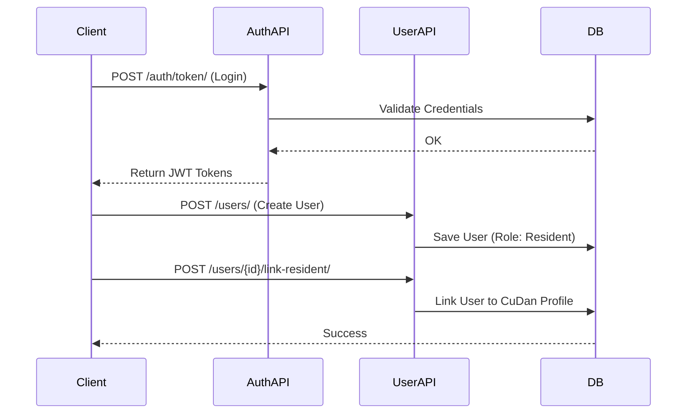
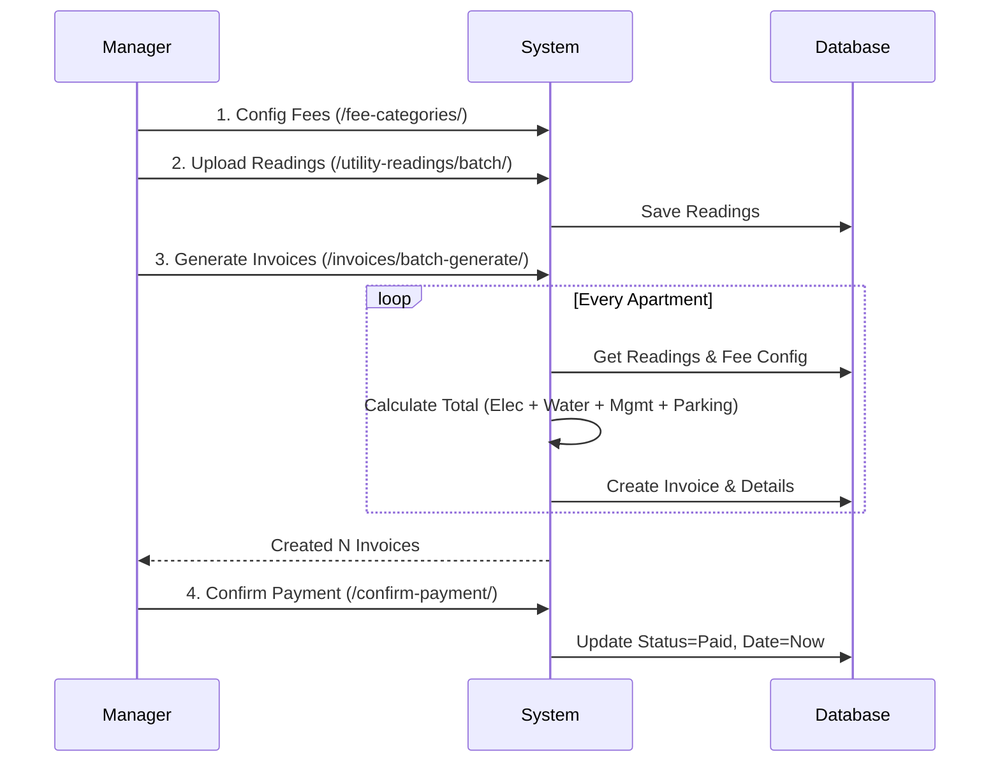

# Phân Tích Luồng Hoạt Động Hệ Thống (API Flow)

Tài liệu này mô tả chi tiết các luồng nghiệp vụ chính trong hệ thống và cách các API tương tác với nhau để thực hiện các nghiệp vụ đó.

## 1. Luồng Khởi Tạo & Quản Lý Người Dùng (User & Auth Flow)

Đây là luồng đầu tiên cần thực hiện để thiết lập các tài khoản quản trị và cư dân.

### Quy trình:
1.  **Đăng nhập (Login)**: Người dùng gửi `username/password` -> Nhận `Access/Refresh Token`.
2.  **Tạo User mới (Admin)**: Admin tạo tài khoản cho Manager hoặc Cư dân mới.
3.  **Liên kết Hồ sơ (Mapping)**: Admin/Manager liên kết tài khoản `User` với hồ sơ `CuDan` tương ứng. Bước này rất quan trọng để Cư dân có thể xem hóa đơn và gửi yêu cầu của chính mình.



---

## 2. Luồng Quản Lý Cư Dân & Biến Động (Resident Lifecycle)

Quản lý vòng đời của một cư dân từ lúc chưa có căn hộ đến khi chuyển vào và chuyển đi.

### Quy trình:
1.  **Thiết lập Căn hộ**: Manager tạo danh sách căn hộ (`POST /apartments/`).
2.  **Tạo Hồ sơ Cư dân**: Manager tạo hồ sơ thông tin cá nhân (`POST /residents/`).
3.  **Chuyển đến (Move In)**:
    *   Manager gọi API `move-in`.
    *   Hệ thống cập nhật căn hộ đang ở của cư dân.
    *   Hệ thống ghi nhận lịch sử vào bảng `BienDongDanCu`.
4.  **Chuyển đi (Move Out)**:
    *   Manager gọi API `move-out`.
    *   Hệ thống gỡ bỏ liên kết căn hộ.
    *   Hệ thống ghi nhận lịch sử "Chuyển đi".

```mermaid
graph TD
    A[Bắt đầu] --> B(Tạo Căn Hộ - /apartments/)
    B --> C(Tạo Hồ sơ Cư dân - /residents/)
    C --> D{Cư dân chuyển đến?}
    D -- Yes --> E[API: /residents/{id}/move-in/]
    E --> F[Update: CuDan.can_ho_dang_o]
    E --> G[Create: BienDongDanCu (ChuyenDen)]
    G --> H[Trạng thái: Cư dân chính thức]
    
    H --> I{Cư dân chuyển đi?}
    I -- Yes --> K[API: /residents/{id}/move-out/]
    K --> L[Update: CuDan.can_ho_dang_o = Null]
    K --> M[Create: BienDongDanCu (ChuyenDi)]
    M --> N[Kết thúc]
```

---

## 3. Luồng Tài Chính & Thanh Toán (Finance Cycle)

Đây là luồng phức tạp nhất, xử lý việc tính toán tiền nong hàng tháng.

### Quy trình:
1.  **Cấu hình Phí**: Manager thiết lập đơn giá Điện, Nước, Phí QL, Gửi xe (`POST /fee-categories/`).
2.  **Chốt Điện Nước**: Hàng tháng, Manager upload chỉ số điện nước (`POST /utility-readings/batch/`).
3.  **Tạo Hóa Đơn (Batch Generate)**:
    *   Manager kích hoạt tạo hóa đơn cho tháng (`POST /invoices/batch-generate/`).
    *   Hệ thống tự động tính toán: `(Số mới - Số cũ) * Đơn giá` + `Phí cố định`.
    *   Lưu snapshot giá tại thời điểm tạo để đối soát sau này.
4.  **Thanh Toán**:
    *   Cư dân xem hóa đơn (`GET /invoices/`).
    *   Cư dân đóng tiền (Offline/Online).
    *   Manager xác nhận (`POST /confirm-payment/`).



---

## 4. Luồng Dịch Vụ & Phản Hồi (Services Flow)

Tương tác hàng ngày giữa Cư dân và Ban quản lý.

### Quy trình:
1.  **Đăng ký Xe**: Manager đăng ký xe cho căn hộ (`POST /vehicles/`). Dữ liệu này sẽ được dùng để tính phí gửi xe trong luồng Tài chính.
2.  **Gửi Yêu cầu (Ticket)**:
    *   Cư dân (đã đăng nhập) gửi báo hỏng/khiếu nại (`POST /support-tickets/`).
    *   Hệ thống tự động gắn ticket với cư dân đó.
3.  **Xử lý Yêu cầu**:
    *   Manager xem danh sách ticket (`GET /support-tickets/`).
    *   Manager cập nhật trạng thái và phản hồi (`PATCH /support-tickets/{id}/`).

---

## 5. Luồng Dashboard & Báo Cáo

Tổng hợp dữ liệu để hiển thị cho người dùng cuối.

### Quy trình:
1.  **Manager Dashboard**:
    *   Gọi `GET /dashboard/manager`.
    *   Hệ thống query: Hóa đơn chưa thu, Ticket đang mở, Tỉ lệ lấp đầy phòng.
2.  **Resident Dashboard**:
    *   Gọi `GET /dashboard/resident`.
    *   Hệ thống query: Hóa đơn chưa trả của *chính căn hộ cư dân đang ở*, Trạng thái các ticket *của chính cư dân*.
3.  **Báo cáo Doanh thu**:
    *   Manager xem biểu đồ doanh thu theo năm (`GET /analytics/monthly-revenue/`).
    *   Hệ thống tổng hợp tiền "Phát sinh" (đã xuất hóa đơn) và "Thực thu" (đã thanh toán).
